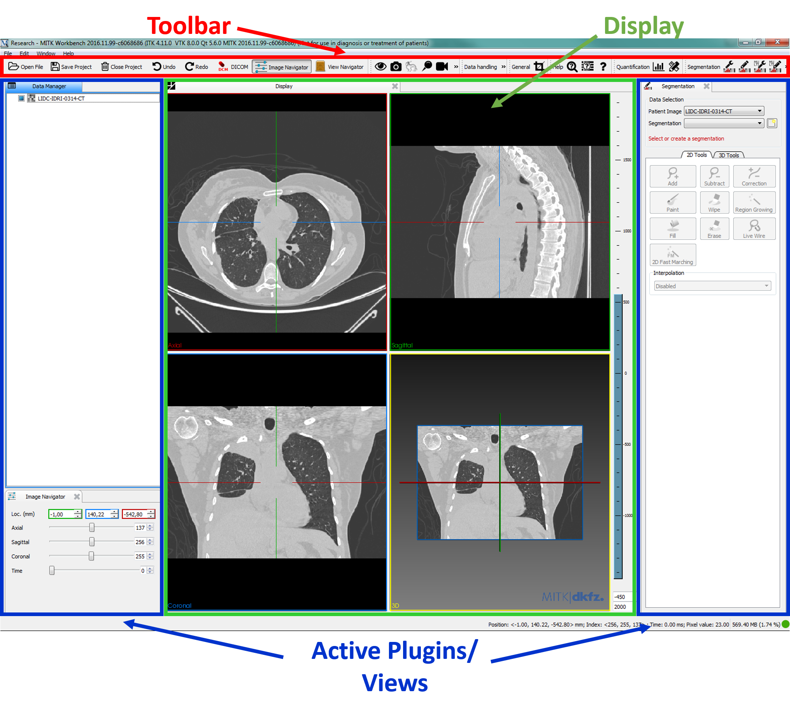

# Step 0: MITK interface basics

The MITK Workbench is a free and user-friendly application built upon the MITK toolkit. Use it to efficiently analyze and visualize medical image data from a wide range of imaging modalities like CT, MR, US, PET, and DICOM-RT. The interface is structured in three main areas:

* **Toolbar** On the upper border you find the Toolbar. With the left buttons you can choose between the main functions \(e.g. open file, save/close project,...\) On the right side you find the Plugins to work on your data.
* **Active plugins** At each sides of the window, the tools you're using can be opened. In MITK they're called Plugins.
* **Display** Your images and results appear in the Display area in 2D and 3D views.

In this tutorial we use only two plugins:

* `DICOM Browser` module to load the DICOM datasets
* `Segmentation` to perform segmentation

