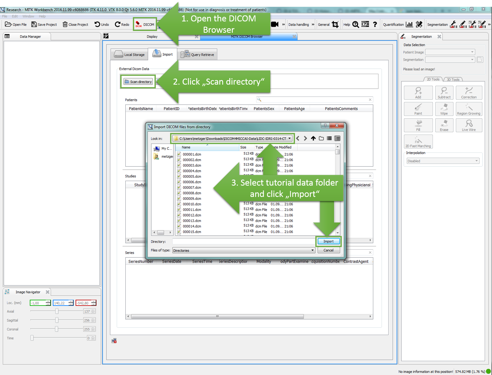
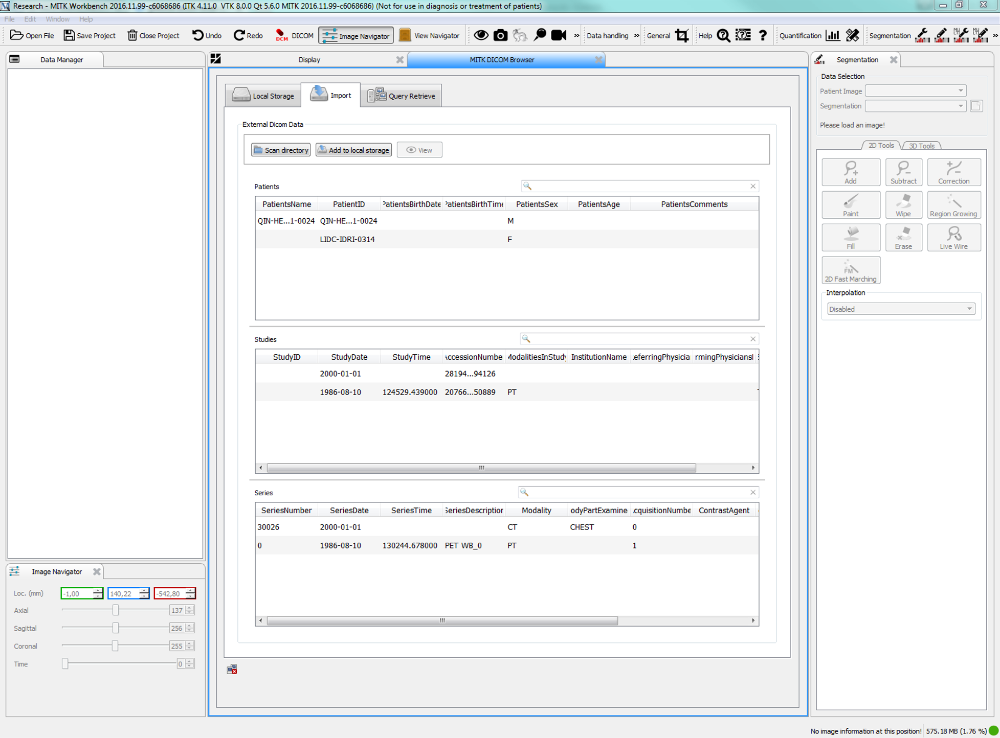

# Step 1: Import DICOM data

As the first step, we need to import the DICOM data that we downloaded in the [Prerequisites](../../prerequisites/) into MITK. To do this, activate the `DICOM Browser` plugin, click the "Scan directory" button to select the data directory, and click "Import", as shown in the screenshot below.

If the import operation was successful, you should see the following items in your `DICOM Browser` window.

