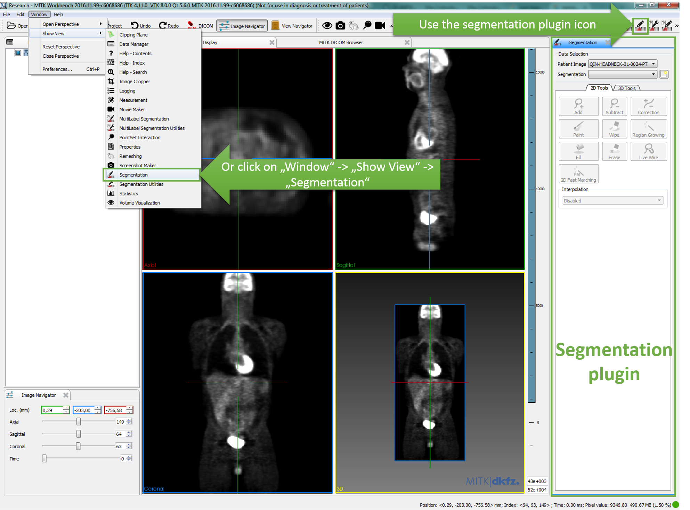
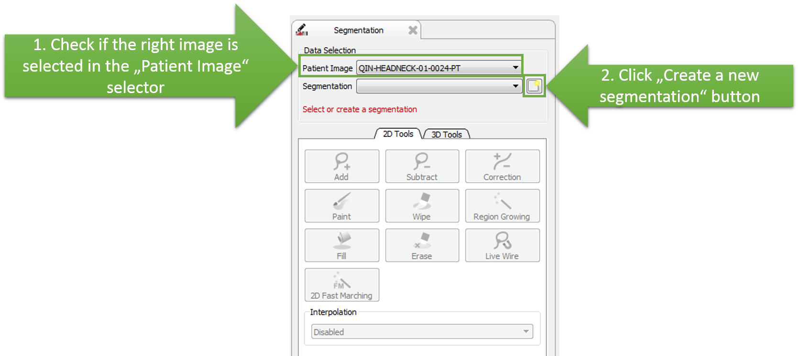
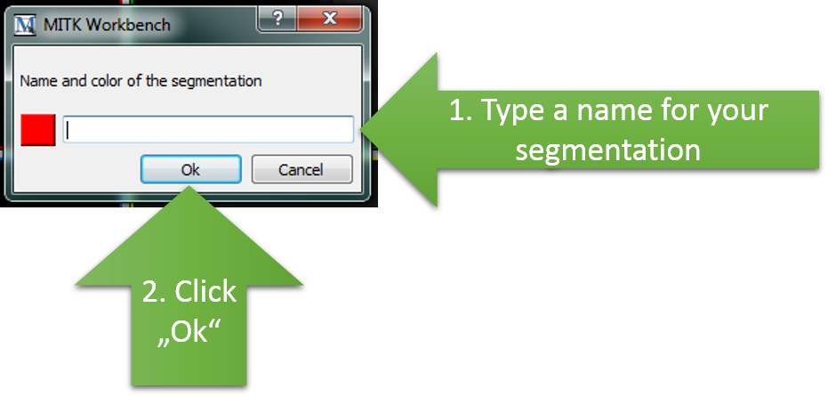
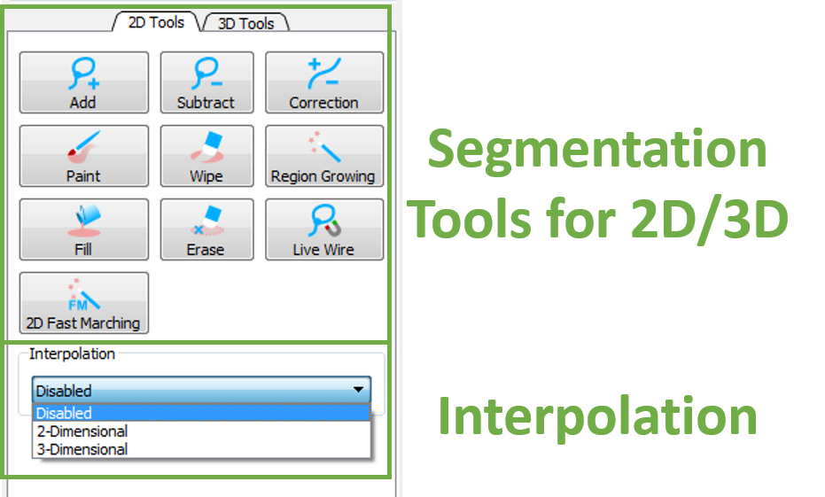

# Step 3: Segment lesions

We will use the `Segmentation` to annotate the loaded PET SUV image with the segmentations of the lesions.

Select the `Segmentation` plugin in the toolbar or by choosing the Segmentation entry at `Window`-&gt;`Show View` in menu bar. On the ride side of the application the `Segmentation` plugin appears.

In the `Data Selection` box you can find two image selectors. In the `Patient Image` selector our image should be already selected. Click on the button next to the `Segmentation` selector.

Now a dialog appears where you can choose a name for your segmentation, e.g. `Neoplasm, primary`. A suggestion list provides you presets with different colors. Of course you can choose your favorite color instead. Confirm your decision by clicking `Ok`. A new `DataNode` is in the `Data Manager` and the `Segmentation` selector in the plugin has now the new segmentation selected.

Various segmentation tools are available, from basic manual contouring, to thresholding and more advanced automated tools. We provide also a interpolation for 2D and 3D. For more information and help please press **F1**.

MITK initialize the metadata for this segment by default:

* **Category**: overall category of the segmentation.
* **Type**: more specific description of the segmentation.
* **Anatomic region**: where applicable, location of the segmented structure.

In our example Segmentation type: "Neoplasm, Primary" which belongs to the "Morphologically Altered Structure" category.

**Try it yourself: Repeat the same sequence of steps to segment the Secondary lesion!**

