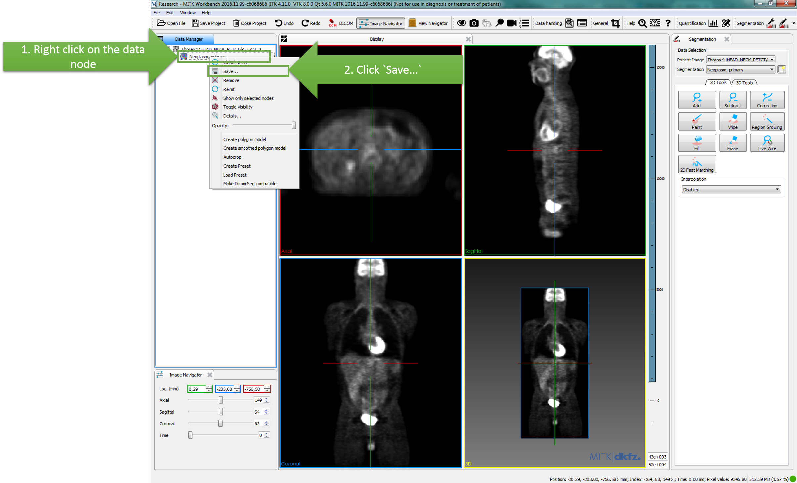

# Step 4: Explore and store the segmentations in DICOM

To create a Segmentation DICOM object which stores the results of the segmentation and metadata for the individual segments you right-click on the segmentation data node in the `Data Manager`.

In the file dialog you can choose the destination and the name of your DICOM Segmentation object. Please note that the data type is set to `DICOM SEG (*.dcm)`. Click the `Save` button and your data will be saved.

