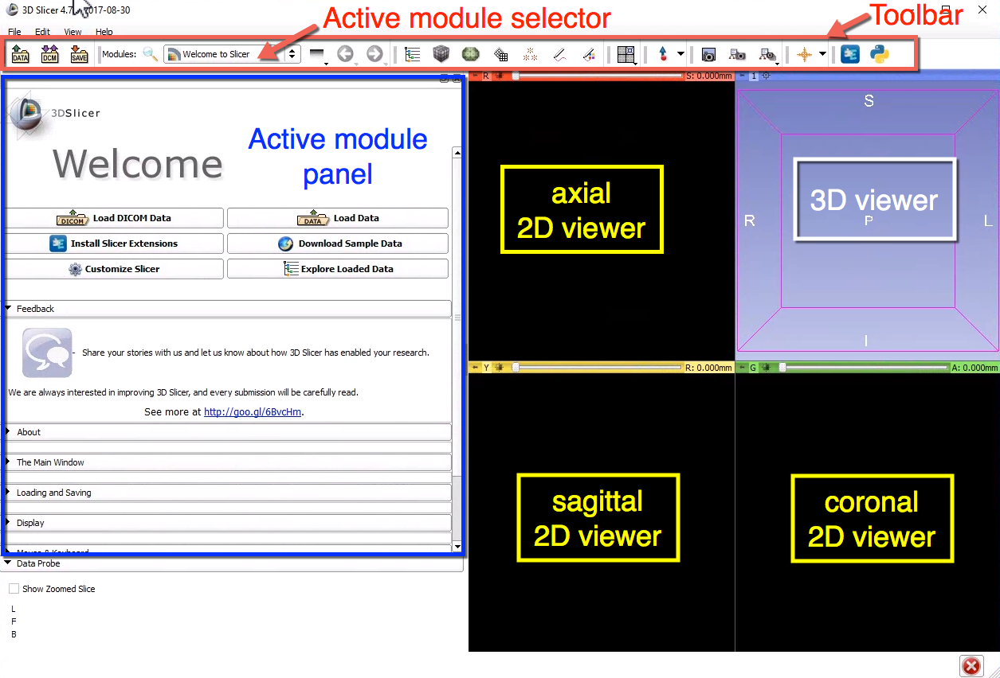

# Step 0: 3D Slicer interface basics

3D Slicer is a versatile platform that has many different capabilities. These capabilities are implemented in Slicer _modules_, and utilize common elements of the Slicer interface:

* **Toolbar** provides you with the active module selector, and shortcuts to the most commonly used modules and functionalities
* **Active module panel** shows the user interface for the module currently selected
* **2D and 3D viewers** are used to visualize 2D reformats of the image data with the various overlays \(segmentations, annotations, intersections with models\), and the 3D views of the data \(volume rendering, model surfaces, annotations\), respectively

In this tutorial we will use just 2 modules of 3D Slicer:

* `DICOM Browser` module to load the DICOM datasets
* `Quantitative Reporting` to perform segmentation and quantitation of the DICOM images

