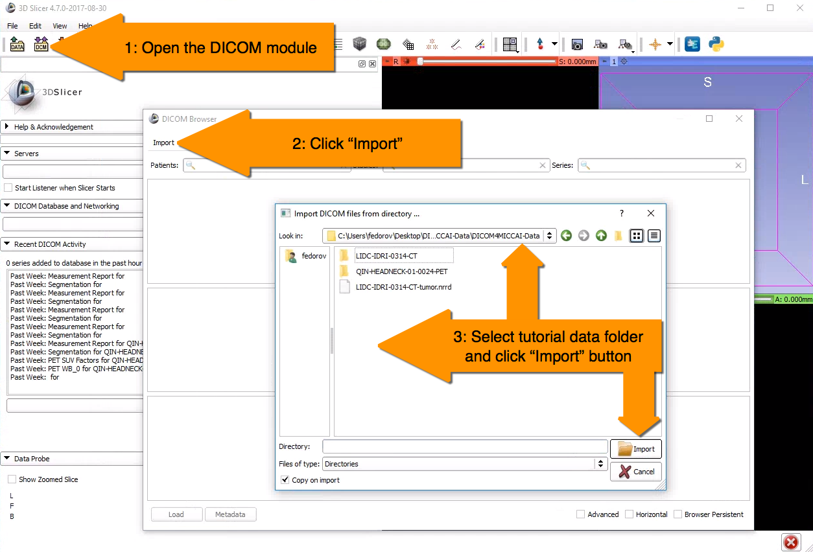
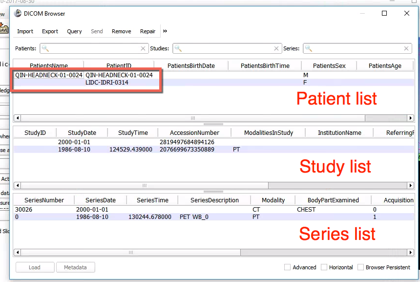

# Step 1: Import DICOM data

As the first step, we need to import the DICOM data that we downloaded in the [Prerequisites](../../prerequisites/) into Slicer. To do this, activate the `DICOM Browser` module, click the "Import" button in the DICOM module popup to select the data directory, and click "Import", as shown in the screenshot below. When prompted, choose "Add link" to avoid copying the dataset.

If the import operation was successful, you should see the following items in your `DICOM Browser` window.

