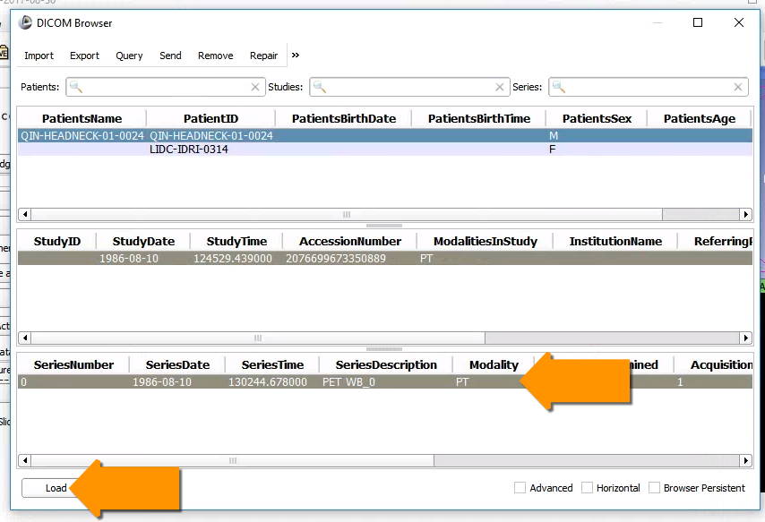
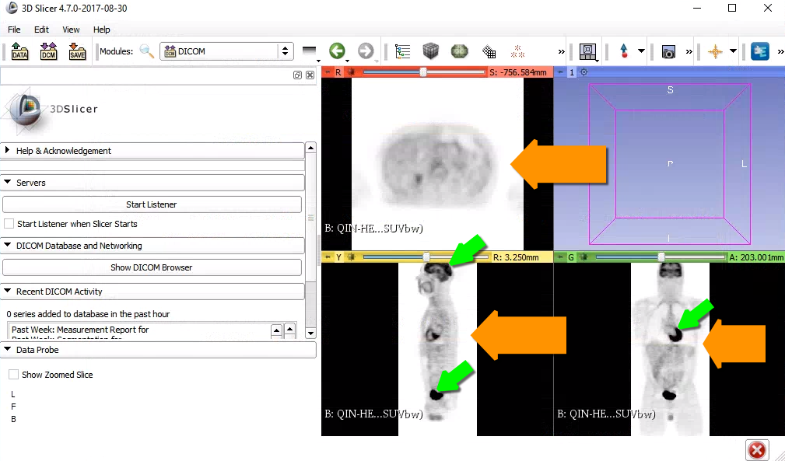

# Step 2: Load DICOM image

Now that the DICOM images are indexed in the Slicer DICOM database we can open the individual image series. In the `DICOM Browser` window, select the item `QIN-HEADNECK-01-0024` in the patient list, and the only image series with modality `PT` \(Positron Emission Tomography, or PET\).

Once the image is loaded, you should automatically see it in the 2D slice viewers \(orange arrows below\). This is a PET image that was obtained after injecting the [fluorodeoxyglucose \(FDG\) radioactive tracer](http://bit.ly/2x1hODX), which is a marker of tissue uptake of glucose, in turn closely correlated with certain types of tissue metabolism. The image you see has been normalized by the patient weight to show [Standardized Uptake Value \(SUV\)](https://en.wikipedia.org/wiki/Standardized_uptake_value) at each pixel, with the lower values \(darker pixels\) corresponding to larger SUV values. You can see right away the regions that show increased SUV are brain, heart and bladder \(green arrows below\).

