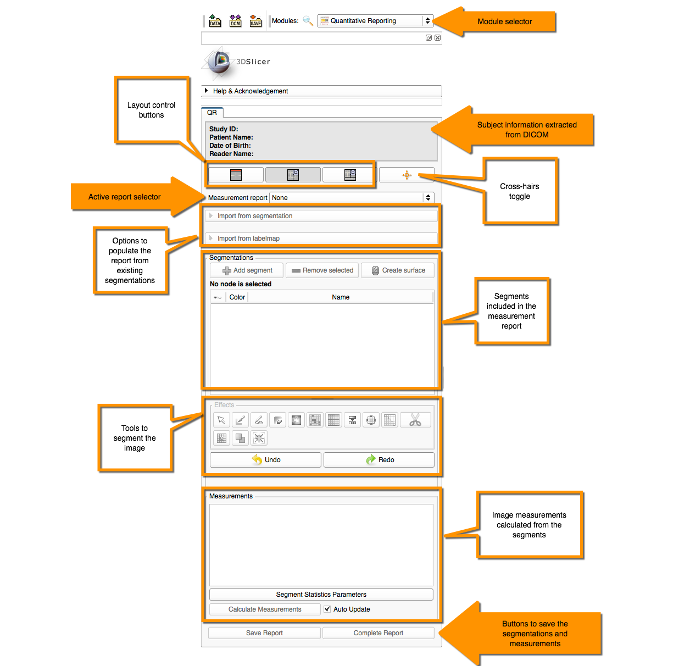
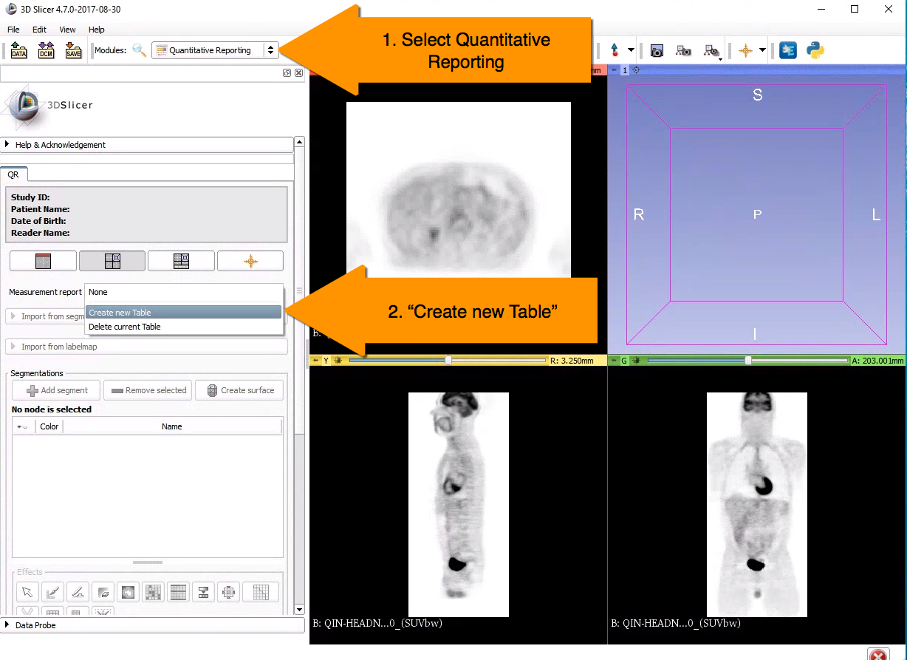
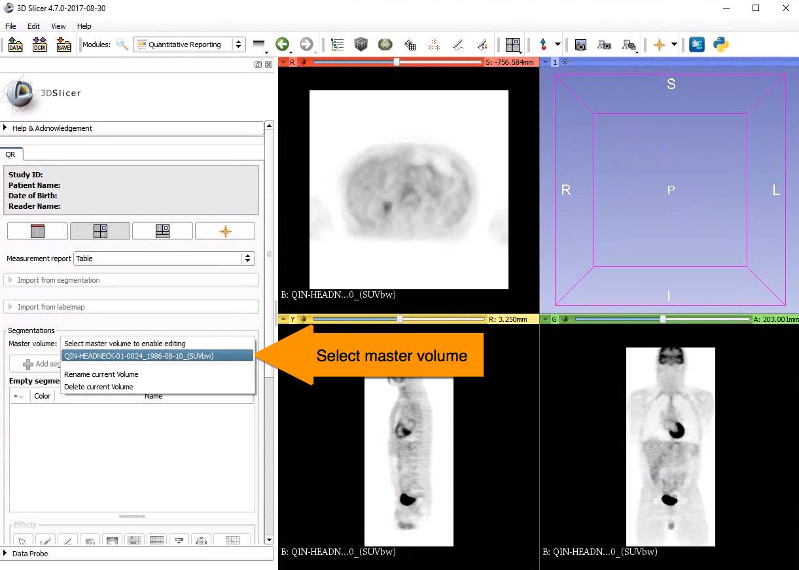

# Step 3.1:QuantitativeReporting interface overview

`Quantitative Reporting` is a module that supports segmentation and measurements from a DICOM image series.

Once the module is selected, choose "Create new Table" in the "Measurement report" selector in the module UI. This will create the top level data structure that will keep pointers to the image and the analysis results in the Slicer application.

Once the report node is created, you will see selector for the "master volume" - this is the volume we will be segmenting. Click the selector, and choose the only item in the drop-down list named `QIN-HEADNECK-01-0024_1986-08-10_(SUVbw)` that corresponds to the SUV volume we have just loaded.

Now we are ready to do the segmentation! First locate the lesions in the dataset downloaded in the [Prerequisites](../../prerequisites/). Scroll to the level of head in the axial 2D viewer \(you can use move the mouse with the right mouse button pressed to zoom in\). You will see some areas highlighted below that are darker than the surrounding tissue - we will segment those metabolically active areas using automated segmentation tools.

