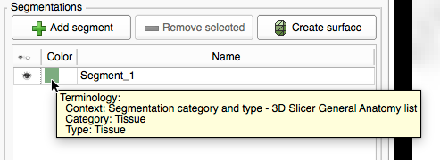
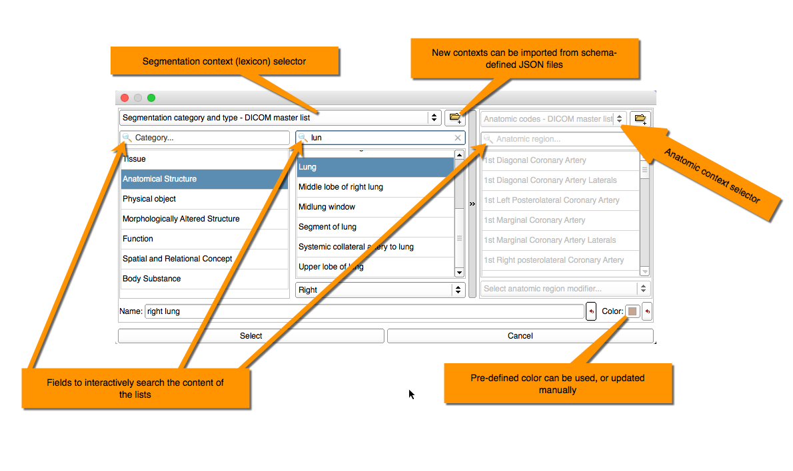
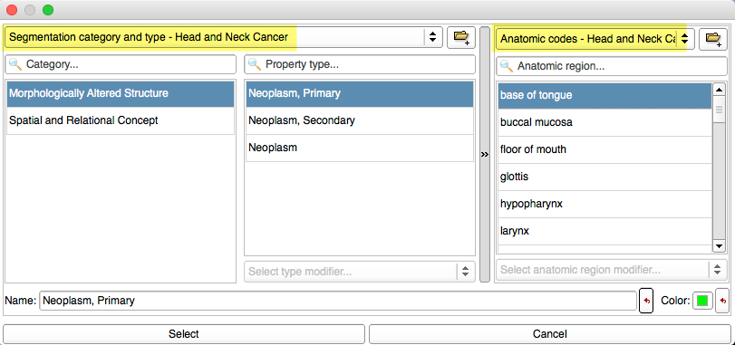
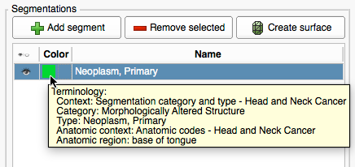

# Step 3.2: Create and initialize a new segment

_A segment_ corresponds to a single structure or finding in the image. Use "Add segment" button to create a new segment. Once the segment is created, you should see a new entry in the segments list. The segment itself is empty \(no image voxels have been segmented yet\), but it has a default color and metadata. You can see the latter in the tooltip by placing your mouse over the square color patch.

Next we will initialize this metadata to the values meaningful in our situation. Double-click the colored patch to open the segmentation terminology window. This window allows to select segment the following structured attributes for each segment:

* **Category**: overall category of the segmentation.
* **Type**: more specific description of the segmentation.
* **Anatomic region**: where applicable, location of the segmented structure.

"Anatomic region" selector will be disabled when it is not applicable \(e.g., when segmentation category is "Anatomic structure"\). "Type" and "Anatomic region" have modifier selectors, which are applicable to some items. These can be used to differentiate between left and right organs, for example.

Content of the lists is defined by the segmentation and anatomic contexts, or lexicons. 3D Slicer includes the lexicons of terms commonly used in 3D Slicer, and also those that are included in the DICOM standard. However, they can also be defined by the user or application developer \(you can read more in [this article](https://qiicr.gitbooks.io/dcmqi-guide/user_guide/coding_schemes.html) from the [dcmqi user guide](https://qiicr.gitbooks.io/dcmqi-guide)\).

In our case, we will select the lexicon defined specifically for describing the structures relevant in segmenting PET images for head and neck cancer:

We will first be segmenting primary lesion \(Segmentation type: "Neoplasm, Primary"\), which belongs to the "Morphologically Altered Structure" category. "Anatomic region" selector contains locations where head and neck cancer lesions are commonly encountered. After you confirmed the selection of metadata for the new segment, you should see it in the tooltip as shown below.

