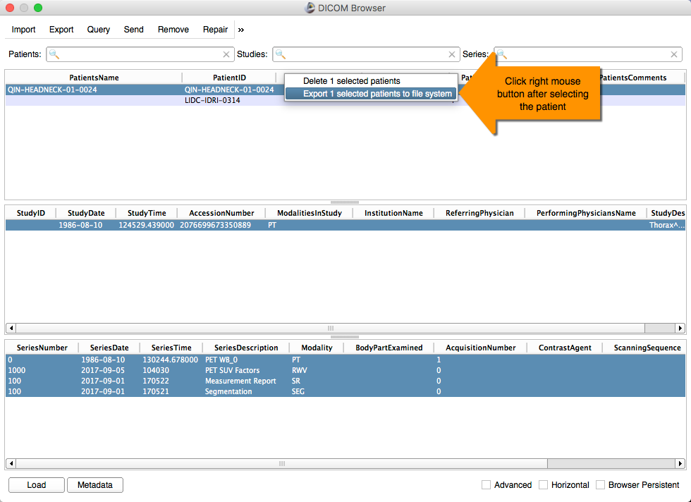

# Exporting DICOM data from 3D Slicer

You can export the DICOM objects you created using 3D Slicer to the file system, if you want to pass them to someone, archive in another system, process with another tool \(such as MITK Workbench, which is also covered in this tutorial!\) etc.

To do this, open "DICOM Browser", select the item you want to export \(at the Patient, Study or Series level\), and click the right mouse button. You will see the dialog prompting you to choose the export location.

