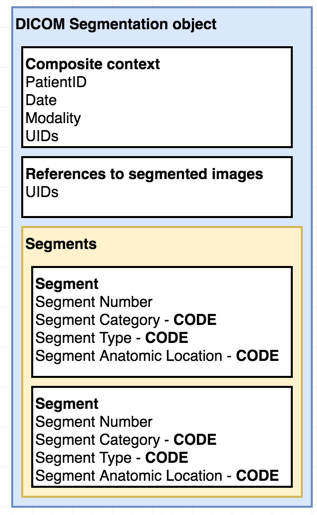

# Using 3D Slicer to convert non-DICOM segmentation results

In this part of the tutorial we will start with a chest DICOM CT dataset, and a segmentation of a nodule stored using NRRD format. We will use this example to illustrate the differences and advantages of the DICOM Segmentation representation, and to demonstrate the steps of generating such standardized representation using 3D Slicer.

### Background

DICOM provides various means to store segmentations, with the most commonly known being DICOM Radiotherapy \(RT\) Structure Sets \(RTSS\). RTSS represents segmentation as a set of planar contours. In this tutorial we will discuss the use of DICOM Segmentation image, which represents segmentation as a labeled image voxels. The differences between DICOM RTSS and DICOM Segmentation are discussed in [this article](https://qiicr.gitbooks.io/dcmqi-guide/user_guide/faq.html#do-you-support-dicom-radiation-therapy-structure-sets-rt-struct).

DICOM Segmentation object is defined in [this section](http://dicom.nema.org/medical/dicom/current/output/html/part03.html#sect_A.51) of the DICOM standard . The picture below shows the high-level organization of a subset information that can be stored in this object.

Metadata for the individual segments is stored in the [Segmentation Image Module](http://dicom.nema.org/medical/dicom/current/output/html/part03.html#sect_C.8.20.2) &gt; [Segment Description Macro](http://dicom.nema.org/medical/dicom/current/output/html/part03.html#table_C.8.20-4). The content of those attributes can be explored with the [dcmqi web app](http://qiicr.org/dcmqi/#/seg).

Note the items that are marked with "CODE": those correspond to triplets of \(CodeValue, CodingSchemeDesignator, CodeMeaning\) attributes.

### Hands-on exercise notes

* Load LIDC dataset and corresponding segmentation \(DICOM4MICCAI-2018/DICOM4MICCAI-Data-part1/LIDC\*\)
* discuss the limitations of a representation
* populate metadata using Quantitative Reporting module
* export as DICOM
* reload
* export to file system
* discuss the organization of the DICOM Segmentation
* examine the contents of the resulting DICOM file \(Atom editor\)
* batch conversion: [dcmqi](https://github.com/qiicr/dcmqi), [dcmqi web app](http://qiicr.org/dcmqi/#/home)

